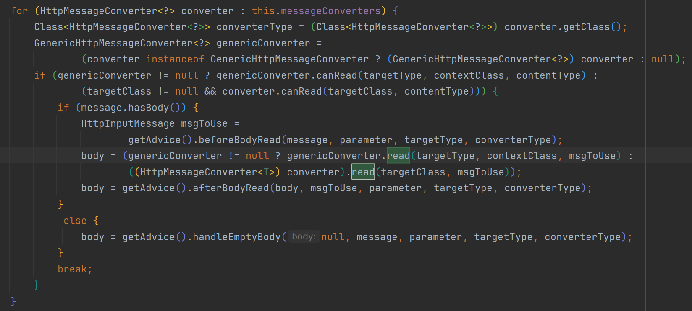
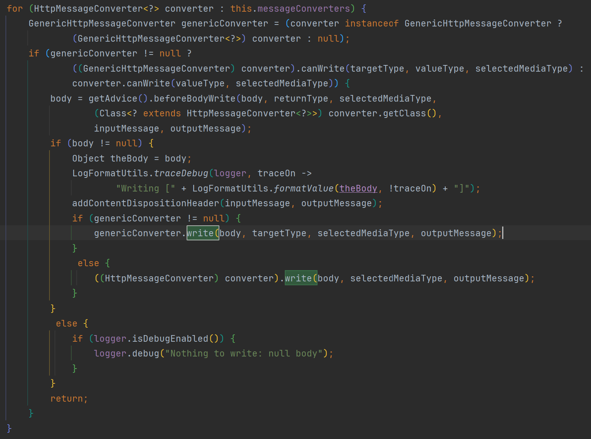

### @ResponseBody는 어떻게 Java 객체를 JSON 형식으로 보낼 수 있을까?

계기는 이전에 작성한 포스트 속 문장이었다.

> 그러나 `ResponseEntity`를 사용하지 않더라도, `@RestController`나 `@ResponseBody` 어노테이션을 쓴다면 자바 객체를 return하는 것만으로도 간단히 HTTP Response에 직렬화된 형태의 HTTP Body를 실어 보낼 수 있다.
> 출처: https://bomlee427.github.io/homedoc-devlog-3-1/

단지 어노테이션 하나 달았을 뿐인데, 대체 이런 마법이 어떻게 가능한 것일까?
추측해 본다면, 스프링이 해당 어노테이션이 붙은 메서드나 컨트롤러를 스캔한 뒤 HTTP 응답으로 변환하여 돌려주는 것이라고 생각할 수 있을 것이다.
하지만 어디까지나 추측일 뿐이고, 또 추상화되지 않은 실제 동작까지는 설명할 수 없는 자신을 발견했다.

그래서 오늘은 Spring이 구체적으로 어떤 클래스를 통해 응답을 처리하는지, 또 이와 같은 어노테이션 기반 프로그래밍이 어떤 맥락에서 이루어지는지 등을 알아보기로 했다.

(이하 공식 문서 번역은 모두 파파고의 도움을 받았다.)

---

### Annotated Controllers

> Spring MVC provides an __annotation-based programming model__ where `@Controller` and `@RestController` components use annotations to express request mappings, request input, exception handling, and more.
> 
> 스프링 MVC는 `@Controller` 및 `@RestController` 구성 요소가 주석을 사용하여 요청 매핑, 요청 입력, 예외 처리 등을 표현하는 __주석 기반 프로그래밍 모델__ 을 제공합니다.
> 
> 출처: https://docs.spring.io/spring-framework/reference/web/webmvc/mvc-controller.html

문서에 따르면, Spring MVC는 컨트롤러에 어노테이션을 다는 것만으로도 다양한 Web 작동을 표현할 수 있도록 해 준다.
어노테이션의 종류로는 각 메서드를 HTTP 요청과 매핑할 수 있는 `@RequestMapping`, HTTP 요청의 다양한 속성을 메서드 인수로 넘길 수 있도록 하는 __Method Arguments__ 어노테이션(`@RequestBody`, `@RequestHeaders` 등), 리턴 값을 HTTP 응답의 다양한 속성으로 표현할 수 있도록 하는 __Return Values__ 어노테이션(`@ResponseBody`, `@ResponseHeaders` 등) 등이 있다.

즉, "`@ResponseBody`는 Spring Web MVC 스택이 지원하는 어노테이션 기반 프로그래밍 모델에 포함된다" 고 설명할 수 있는 것이다.

### @ResponseBody의 실제 동작

그렇다면 `@ResponseBody`는 실제로 어떻게 동작할까?

> You can use the `@ResponseBody` annotation on a method to have the return serialized to the response body through an `HttpMessageConverter`.
> 
> 메서드의 `@ResponseBody` 주석을 사용하여 `HttpMessageConverter`를 통해 응답 본문에 반환을 직렬화할 수 있습니다. 
> 
> 출처: https://docs.spring.io/spring-framework/reference/web/webmvc/mvc-controller/ann-methods/responsebody.html

`@ResponseBody`는 `HttpMessageConverter`를 사용해 HTTP 응답 본문을 직렬화한다고 한다. 그러니 우리가 찾는 정답은 `HttpMessageConverter`에 숨어 있을 것이다.

> The spring-web module contains the `HttpMessageConverter` interface for reading and writing the body of HTTP requests and responses through `InputStream` and `OutputStream`. 
> 
> 스프링-웹 모듈에는 `InputStream` 및 `OutputStream`을 통해 HTTP 요청 및 응답 본문을 읽고 쓰기 위한 `HttpMessageConverter` 인터페이스가 포함되어 있습니다.
> 출처: https://docs.spring.io/spring-framework/reference/integration/rest-clients.html#rest-message-conversion

즉 `HttpMessageConverter`는 HTTP 메시지를 직렬화/역직렬화하기 위한 일종의 전략 인터페이스로, 실제 동작은 구현체에서 이루어진다. 오늘은 추상화 계층 아래의 실제 동작까지 알아보기로 마음먹었으니 구현체의 코드를 살펴보자.

스프링의 기본 `ObjectMapper` 라이브러리인 `Jackson`의 `HttpMessageConverter` 구현체는 `MappingJackson2HttpMessageConverter`이다.

> Implementation of org.springframework.http.converter.HttpMessageConverter that can read and write JSON using Jackson 2.x's  ObjectMapper.
> 
> org.springframework.http.converter.HttpMessageConverter 구현체로, Jackson 2.x의 ObjectMapper를 사용하여 JSON을 읽고 쓸 수 있습니다.
> 
> 출처: https://docs.spring.io/spring-framework/docs/current/javadoc-api/org/springframework/http/converter/json/MappingJackson2HttpMessageConverter.html

`ObjectMapper`는 Reflection API를 사용해 Java 객체를 직렬화/역직렬화한다.
`ObjectMapper`의 역할과 `ObjectMapper`가 Reflection API를 어떻게 활용하는지에 관해서는 다음 기회에 더 자세히 포스팅하고자 한다.

### DispatcherServlet

Spring MVC에서 HTTP 요청/응답이 "어떻게" 직렬화/역직렬화되는지 간략하게 알아보았다.
그렇다면 "언제" 직렬화/역직렬화 처리가 이루어질까? 즉, `HttpMessageConverter`의 `read()`와 `write()`는 전체 흐름 중 어느 시점에 호출될까?

DisplatcherServlet과 Web Context간의 관계 ([출처](https://docs.spring.io/spring-framework/reference/web/webmvc/mvc-servlet/context-hierarchy.html))

Spring MVC에서 HTTP 요청/응답을 처리하는 주체는 `DispatcherServlet`이다.
`DispatcherServlet`은 HTTP 요청/응답 처리 과정 중 가장 끝점에 위치하며, 모든 HTTP 요청과 응답을 적절한 처리 주체(Special Beans)에게 분배하고 위임하는 일종의 프론트 컨트롤러 역할을 한다.
`HttpMessageConverter`는 `DispatcherServlet`과 `RestController` 사이에서 자바 객체를 직렬화/역직렬화하여 전달하는 역할을 하므로, `DispatcherServlet`과 `RestController` 사이에 위치할 것이라고 추론할 수 있다.

이러한 추측을 가지고 `DispatcherServlet`과 관련된 문서를 뒤지던 중, 다음과 같은 문장을 찾을 수 있었다.

> For `@ResponseBody` and `ResponseEntity` controller methods, the response is written and committed within the `HandlerAdapter`, before `postHandle` is called.
> 
> `@ResponseBody` 및 `ResponseEntity` 컨트롤러 메서드의 경우 응답은 `postHandle`이 호출되기 전에 `HandlerAdapter` 내에서 작성되고 커밋됩니다.
> 
> 출처: https://docs.spring.io/spring-framework/reference/web/webmvc/mvc-servlet/handlermapping-interceptor.html#page-title

이에 따르면 `HttpMessageConverter`는 `HandlerAdapter` 내부에서 작동하는 것이라고 추론할 수 있다. `HandlerAdapter`란 뭘까?

### HandlerAdapter

[DispatcherServlet이 HTTP 요청을 위임하는 처리 주체의 목록(Special Bean Types)](https://docs.spring.io/spring-framework/reference/web/webmvc/mvc-servlet/special-bean-types.html)

핸들러(Handler)란 말 그대로 요청/응답을 처리하는 처리기이다. `DispatcherServlet`은 `HandlerMapping` 인터페이스를 통해 HTTP 요청/응답이 연결되어야 할 적절한 핸들러를 찾아낸다. 이렇게 찾아낸 핸들러를 `HandlerAdapter` 인터페이스가 실제로 실행한다. (코드를 들여다보다 안 사실인데, 이 과정에서도 __Reflection API__ 가 매우 중요하게 사용된다.)

위에서 `HttpMessageConverter`가 `HandlerAdapter` 내부에서 작동한다는 가정을 세웠으니 실제 구현체를 살펴볼 차례다.
`@RequestMapping` 어노테이션이 달린 핸들러 메서드를 처리하는 구현체는 `RequestMappingHandlerAdapter`이다.
내부가 상당히 복잡하여 여기부터는 GPT의 도움을 받았다.

> 나: HttpMessageConverter의 read()와 write()가 호출되는 코드를 보고 싶어.
> 
> GPT: ... `RequestMappingHandlerAdapter` 클래스의 `invokeHandlerMethod` 메서드 내부에서 이 과정이 이루어집니다. `RequestResponseBodyMethodProcessor` 클래스의 `handleReturnValue` 메서드를 통해 `write` 메서드가 호출됩니다. ...

`invokeHandlerMethod()`는 핸들러가 되는 `ServletInvocableHandlerMethod` 타입의 메서드를 실제로 호출하는 기능을 한다. 핸들러 호출에 필요한 다양한 처리를 한 뒤 핸들러를 호출한다.

쭉 따라가 본 호출 스택은 다음과 같다.

| Class | Method |
| --- | --- |
| `HttpMessageConverter` | `read()`/`write()` (헥헥...) |
| | `readWithMessageConverters()`/`writeWithMessageConverters()` |
| `RequestResponseBodyMethodProcessor` | `resolveArgument()`/`handleReturnValue()` |
|  | `getMethodArgumentValues()` |
| `ServletInvocableHandlerMethod` | `invokeAndHandle()` |
| `RequestMappingHandlerAdapter` | `invokeHandlerMethod()` |

찾았다...

구현이 상당히 복잡하지만, 요약하면 `RequestMappingHandlerAdapter`의 `invokeHandlerMethod()`가 실제 컨트롤러 메서드를 호출하기 전/후에 HTTP 요청과 Java 객체 간의 직렬화/역직렬화 과정을 수행해주는 것이다.

### 결론

앞으로 누군가 나에게 "`@ResponseBody`는 어떻게 Java 객체를 JSON 형식으로 보낼 수 있나요?" 라고 묻는다면, 이렇게 답할 수 있겠다.

1. `@ResponseBody`는 Spring Web MVC 스택이 제공하는 기능으로, 해당 어노테이션을 붙이는 것만으로 컨트롤러 메서드의 반환 값을 HTTP 응답의 body로 직렬화할 수 있다.
2. `@ResponseBody`는 `HttpMessageConverter`를 사용해 직렬화를 수행한다.
3. `HttpMessageConverter`는 `DispatcherServlet`이 `HandlerAdapter`를 통해 핸들러(실제 컨트롤러 메서드)를 호출하는 시점에 작동한다.

### 후기
추상화는 복잡한 개념의 이해를 돕는 강력한 도구지만, 트러블슈팅이나 더 좋은 개발을 하기 위해서는 구체적 동작 역시도 알아야 한다. 그러나 Spring처럼 매우 고도로 추상화된 복잡한 프레임워크라면 실제 내부 구현이 어떻게 되어 있는지 간과하기 더욱 쉽다.

평소에 아무 생각 없이 사용하던 컨트롤러 어노테이션의 실제 동작이 이렇게나 복잡한 줄은 꿈에도 몰랐다.
게다가 Spring MVC뿐 아니라 Servlet 등의 기초적 개념에 대해서도 이해가 부족하다는 것을 이번 기회로 뼈저리게 깨달았다.

또한 `ObjectMapper`뿐 아니라 `DispatcherServlet`이 동작하는 과정에서도 Reflection API가 매우 적극적으로 사용되고 있음을 알게 되었다. (런타임 시점에 동적으로 매핑된 메서드를 찾아야 하니 생각해보면 당연하다)
Reflection API는 JPA의 프록시 객체나 스프링 빈 등에도 사용되는 핵심 기술이지만, 이 역시 겉핥기로만 알고 있다는 생각이 들어 다음 기회에 조금 더 깊이 포스팅해보고자 한다.

끝!
